or,
**Everything I've learned so far about R**


## Cheat Sheets

* [R Colors](http://www.stat.columbia.edu/~tzheng/files/Rcolor.pdf)

* [R Base Graphics Cheat Sheet](http://www.joyce-robbins.com/wp-content/uploads/2016/04/BaseGraphicsCheatsheet.pdf)

* [R Base Commands Cheat Sheet](https://www.rstudio.com/wp-content/uploads/2016/10/r-cheat-sheet-3.pdf)

* [R Markdown Cheat Sheet](https://www.rstudio.com/wp-content/uploads/2015/02/rmarkdown-cheatsheet.pdf)

* [Keyboard Shortcuts](https://support.rstudio.com/hc/en-us/articles/200711853-Keyboard-Shortcuts)

* [GGPlot 2 Graphics Walkthrough 1](http://zevross.com/blog/2014/08/04/beautiful-plotting-in-r-a-ggplot2-cheatsheet-3/)

* [GGPlot 2 Graphics Walkthrough 2](https://rkabacoff.github.io/datavis/Customizing.html)

* [GGPlot2 Cheat Sheet](RCheatSheetsAndNotes_files/data-visualization-2.1.pdf)

## Notes

## Wrangling

use dplyr::distinct(var) to select only unique values in a column:


### Using HTML and colors

Most HTML standards apply to RMarkdown and can be used either as is or with minor variations. For instance, text colors:

Color adjustment can be carried out with standard HTML (with divs). 


```r
<div style="color:#EE7942;">

this text is orange
  
$$\chi^2 = `r chisq.test(myT)$statistic`$$

</div>
```


becomes:
 

<div style="color:#EE7942;">

this text is orange

$$\chi^2 = 0.0994243$$

</div>


### Create a .md File alongside your .Rmd

To keep the .md file created as part of knitting your .Rmd, place "keep_md: TRUE" as one of the arguments to the html output of your yAML header.

### Namespacing, Libraries, and Directory

*DON'T FORGET TO LOAD YOUR PACKAGES!*

There are two ways to do this. One, put library(relevant package name) for each package. Two, install pacman and put all the packages in one function call, as seen below:

#### Standard Packages

```r
library(mosaic) 
library(car) 
library(pander) #for beautifying
library(DT) #For User-friendly tables
library(ggthemes) # For Beautiful GGPlot Graphics
library(ResourceSelection) #For Hoslem-Lemeshow GOF test
library(reshape) #for reshaping matrices (melt())
library(tidyverse)  ## the core tidyverse package. 
library(cowplot) # For facetting and granular graph control
library(ggbeeswarm) # For geom_beeswarm()
library(patchwork)# For dead-simple facetting
library(ragg) #for graphical edits using AGG
#dplyr and several other tidyverse functions mask car and base R
#functions, so load tidyverse last or namespace your functions to
#avoid unnecessary pain and heartache at the hands of filter().

#The alternate, shorter form:
pacman::p_load(mosaic,car,pander,ggthemes,
               reshape,ggbeeswarm,cowplot,patchwork,tidyverse)
```


Or, if you don't want to, remember to namespace your functions: 

```r
car::qqPlot(KidsFeet$Length)  
pander::pander("every piece of code")
```


#### Directory

check your directory with getwd() (the working directory of this file is:  /Users/daniel/Documents/danstats/notes), set it with setwd(). 


```r
getwd()
#Set this Directory on a mac:
setwd("Users/daniel/Documents/MATH325/Notebook-Student") 

setwd("D:/phils/doctor/math325/Notebook-Student")
```

*Note that on a Windows Computer, the file system uses backslashes "\\", while R uses forward slashes "/" ONLY. This is likely to escape the fact that in RMarkdown, the backslash is the escape character, and file directories would therefore need to be written with two slashes per level to escape the escape factor.  


### File Editing/Directories
Use file.edit("PATH_TO_FILE/FILE_NAME") to open .Rmd files in the IDE. Use str() to examine the structure of a dataset. getwd() fetches the current working directory of the console, while dir() shows the contents thereof. setwd("FILEPATH") uses a fully qualified or local domain to set the working directory.


### Filtering Datasets
To specify which subset of a dataset to use in a function such as mean(), wilcox.test(), table(), etc., either create a permanent, filtered subset of the data (Example 1) or add a condition using the [] square brackets (Examples 2 and 3)

```r
#Example 1
Auto_MTC <- dplyr::filter(mtcars, am == 0)
manual_MTC <- dplyr::filter(mtcars, am == 1)
mean(Auto_MTC$hp)
mean(manual_MTC$hp)
#results in:
#160.2632
#126.8462

#Example 2
mean(mtcars$hp[mtcars$am == 0])
mean(mtcars$hp[mtcars$am == 1])
#results in:
#160.2632
#126.8462

day_riders <- dplyr::filter(Riders, day == "Sunday")
sum(day_riders$ct)
sum(Riders$ct[Riders$day == "Sunday"])

#Example 3
wilcox.test(x = Salaries$salary[Salaries$discipline == "A"],
            y = Salaries$salary[Salaries$discipline == "B"] )
#results in:
#data:  Salaries$salary[Salaries$discipline == "A"] and Salaries$salary[Salaries$discipline == "B"]
#W = 15710, p-value = 0.0007516
#alternative hypothesis: true location shift is not equal to 0
```

### Mutate/Cut
Also useful is the cut() function, which can create selection subsets as a permanent portion of the existing dataset. library(tidyverse) implements a more verbose but prettier way to do the same thing:

```r
#Base R and the cut()
Blackmore$ageGroup <- cut(Blackmore$age, c(7,10,12,14,18), labels=c("Youth","Pre-Teen","Early-Teen","Late-Teen"), ordered_result=TRUE)

#Tidyverse version
Blackmore <- Blackmore %>%
   mutate(ageGroup = case_when(age >= 8 & age <= 10 ~ "Youth",
                               age > 10 & age <= 12 ~ "Pre-Teen",
                               age > 12 & age <= 14 ~ "Early-Teen",
                               age > 14 & age <= 18 ~ "Late-Teen"
# If you want to add an else statement for all other variables, 
                               # use TRUE ~ "other"
                               ) ,
          
          #Turns it into a factor
          ageGroup = factor(ageGroup, 
                            levels=c("Youth", "Pre-Teen", "Early-Teen", "Late-Teen"), 
                            ordered=TRUE)
                            )
```


To remove NA from Side by Side Boxplots or other data sources you couldn't filter prior (using na.rm = TRUE) in ggplot, use data= na.omit(DATASET)

```r
ggplot(data = na.omit(HSS), aes(x = as.factor(plot_langs),y= Score_in_memory_game )) + 
  geom_boxplot()
```

### Summaries with summarise() and favstats()

#### Mode in Base R

 There is no mode function in base R. However, table() is very good at counting, so try a sort(table(mydata$variable)) and look at the end, or specify a decreasing = TRUE to your sort function and it'll be the first one:


```r
#this is a fake data set with 2x as many 5s as anything else
tubers <- rep(c(1,2,3,4,5,5,6,7,8),10)

#mode at the end
sort(table(tubers))
```

```
## tubers
##  1  2  3  4  6  7  8  5 
## 10 10 10 10 10 10 10 20
```

```r
#mode at the beginning
sort(table(tubers), decreasing = T)
```

```
## tubers
##  5  1  2  3  4  6  7  8 
## 20 10 10 10 10 10 10 10
```

To rename columns when using summarise() and group_by(),
use quotation marks "" and "" = format()

```r
#Mutation and filter to enable summary code because I'm too lazy to write a new one right now
HSS <- HSS %>% mutate(plot_langs = case_when(
    Languages_spoken %in% c(0, 1, 1.5) ~ " Unilingual",
    Languages_spoken %in% c(2, 3, 4) ~ "Multilingual"
    ) 
    )
HSS <- HSS %>% dplyr::filter(
      Languages_spoken != "NA",
      Score_in_memory_game > 15,
      Score_in_memory_game < 100,
      Score_in_memory_game != "NA"
    )
```


```r
pander(HSS %>% 
  group_by("Language Status" = format(plot_langs)) %>% 
  summarise(
    "Min" = min(Score_in_memory_game), 
    Q1 = quantile(Score_in_memory_game,.25), #Quote marks are not necessary for one word titles
    Mean = mean(Score_in_memory_game),
    Q3 = quantile(Score_in_memory_game, .75),
    Max = max(Score_in_memory_game),
    "Standard Deviation" = sd(Score_in_memory_game)#but they are needed for those with a space in them
  )
)
```


--------------------------------------------------------------------
 Language Status   Min   Q1   Mean    Q3   Max   Standard Deviation 
----------------- ----- ---- ------- ---- ----- --------------------
   Unilingual      25    39    47     52   93          12.48        

  Multilingual     20    36   43.78   49   81          10.89        
--------------------------------------------------------------------
Without pander()ing, output looks like:

```r
HSS %>% 
  group_by("Language Status" = format(plot_langs)) %>% 
  summarise(
    "Min" = min(Score_in_memory_game), 
    Q1 = quantile(Score_in_memory_game,.25), #Quote marks are not necessary for one word titles
    Mean = mean(Score_in_memory_game),
    Q3 = quantile(Score_in_memory_game, .75),
    Max = max(Score_in_memory_game),
    "Standard Deviation" = sd(Score_in_memory_game)#but they are needed for those with a space in them
  )
```

```
## # A tibble: 2 × 7
##   `Language Status`   Min    Q1  Mean    Q3   Max `Standard Deviation`
##   <chr>             <dbl> <dbl> <dbl> <dbl> <dbl>                <dbl>
## 1 " Unilingual "       25    39  47.0    52    93                 12.5
## 2 "Multilingual"       20    36  43.8    49    81                 10.9
```

Note that favstats() can also be index specified:

```r
pander(favstats(HSS$Score_in_memory_game)[c("min", "median", "mean", "max", "n")])
```


----------------------------------
 min   median   mean    max    n  
----- -------- ------- ----- -----
 20      44     45.71   93    447 
----------------------------------


### Tables
Tables are very useful, utilize rbind, cbind(), and t()

```r
#bind data to ROWS
mytable <- rbind(single = c(morning = 25, afternoon = 20, evening = 105),
                 dating = c(15, 15, 40),
                 married = c(15, 15, 50))
#bind data to COLUMNS
meintable <- cbind(morning = c(single = 25, dating = 15, married = 15),
                   afternoon = c(20, 15, 15),
                   evening = c(105, 40, 50))

#These tables are the SAME.
mytable
```

```
##         morning afternoon evening
## single       25        20     105
## dating       15        15      40
## married      15        15      50
```

```r
meintable
```

```
##         morning afternoon evening
## single       25        20     105
## dating       15        15      40
## married      15        15      50
```

```r
#use t() to transpose columns to rows and vice versa
t(meintable)
```

```
##           single dating married
## morning       25     15      15
## afternoon     20     15      15
## evening      105     40      50
```

```r
#Now the first table has columns for the second table's rows.
mytable
```

```
##         morning afternoon evening
## single       25        20     105
## dating       15        15      40
## married      15        15      50
```

```r
meintable
```

```
##         morning afternoon evening
## single       25        20     105
## dating       15        15      40
## married      15        15      50
```

### Lists
Lists are object types which may hold any number of types of variable.

```r
barplot(mytable,
        beside = TRUE, #clustered instead of stacked
        legend.text = TRUE, #quick create legend
        args.legend = list(x = "top", #change legend placement
                           horiz = TRUE, #change legend type (horiz instead of vert)
                           bty = "n", #legend 
                           inset = c(0, -.1)),
        main = "Student Gym Preferences at BYU-I",
        col = c("skyblue", "orange", "grey"))
```

<!-- -->

### Predict
Use the Predict function to easily predict multiple observations given a model

```r
predict()
predict.glm()
```


Use Function notation wherever possible: `y ~ x, data = `

Tabbed html documents:  {.tabset .tabset-fade}

Create a table of contents by specifying toc in the Rmd header:

```r
---
title: "R Cheat Sheets & Notes" #specify the title at the top of the document
output: 
  html_document: #specify document type for the compiler
      toc: true #create a table of contents
      toc_float: true #cause table of contents to follow user through document instead of staying at the top
---
```

For loops are gross and you should always be able to find something better to do, except maybe in permutation testing. IF you need one:

```r
# in _:_ creates an array with the two values as min/max and loops for each value inside
 for(mnth in 5:9) {
    John <- dplyr::filter(airquality, Month == mnth) 
    print(mean(John$Temp))
 }
```

```
## [1] 65.54839
## [1] 79.1
## [1] 83.90323
## [1] 83.96774
## [1] 76.9
```

```r
# in c(...) takes each value in the c() and tests for those values
 for(i in c(484,1004,1372) ){
    Orange_Mths <-dplyr::filter(Orange, age == i)
    print(median(Orange_Mths$circumference))
 }
```

```
## [1] 58
## [1] 125
## [1] 174
```

```r
#You can also pass a premade, custom list to clean up the loop itself:
cars_length <- list(1,2,3,4,5,6,7,8)
for(x in cars_length) {
    print(mtcars$mpg[x])
}
```

```
## [1] 21
## [1] 21
## [1] 22.8
## [1] 21.4
## [1] 18.7
## [1] 18.1
## [1] 14.3
## [1] 24.4
```

```r
for(x in seq_len(nrow(mtcars))) {
  
  
}
```


In RMarkdown HTML output, any markup not covered by Markdown's syntax can simply be input using HTML syntax. For example, the &mdash; is input by typing `&mdash;`

### XYplots

The lattice package (also accessible through mosaic) has a wonderful ANOVA plotting function known as xyplot(). GGPlot can do the same thing but here's how xyplot works:


```r
xyplot(aloft~model, groups = unit, data = plane, type = c("p", "a"), auto.key = list(corner = c(1,1)))
```

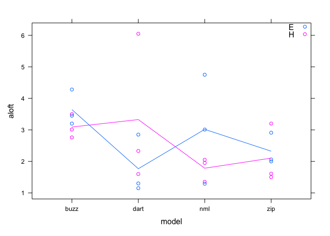<!-- -->

For a two or three way ANOVA, additional factors can be specified using groups =. 

To create a quick-and-dirty key, use auto.key = list(corner(c(1,1)))

To specify whether average lines, data points, or both are to be included, use type = c() with "a" being average lines, "p" being points. More options available in documentation.

In GGplot, use this:


```r
ggplot(plane, aes(y =aloft, x =as.numeric(model), 
                  color = unit)) + geom_point() + 
  stat_summary(fun = mean, 
               geom = "line")
```

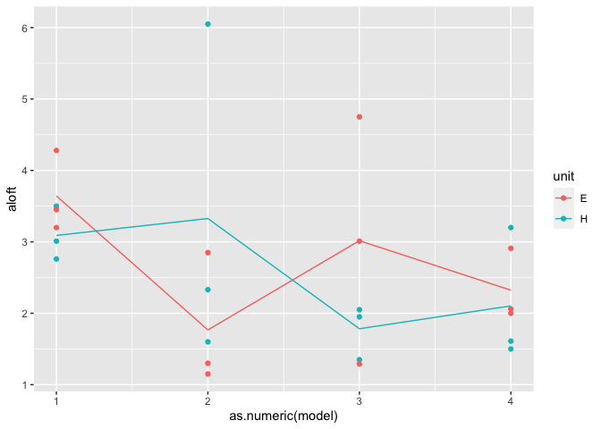<!-- -->

stat_summary() performs a visual aggregation (as in aggregate()) of the function given (fun=). geom= specifies what form this visualization will take; "line", "point", etc.

### Diagnostic plots
To quickly examine residuals vs Fitted, QQplot of residuals, and Residuals vs Leverage, use plot(), include ",which = 1:2" for only first two plots.

```r
plot(air_temp_anova, which = 1:2) 


qqPlot(air_temp_anova)
```

to create an equal variance plot WITHOUT the red line of confusion:


```r
#Function to plot it:
cl_res <- function(aovout){
  temp <- max(abs(aovout$residuals))
  plot(aovout$fitted.values, aovout$residuals, xlab = "Fitted Values",
       ylab = "Residuals", main = "Equal Variance Check", pch = 16, 
      ylim = c(-temp, temp))
  abline(h=0, col = "gray", lty = 2)
}
#and the function call, just like plot()ting your ANOVA model.
cl_res(planova)
```

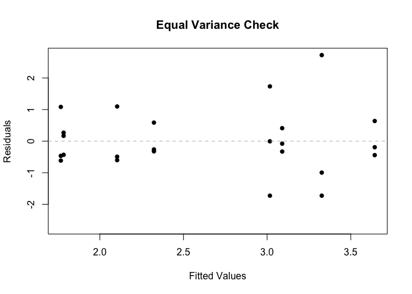<!-- -->

Creating Residual plots with the cool lines in ggplot:
[Blog Post](https://drsimonj.svbtle.com/visualising-residuals)


#### QQPlots

[qqPlot Documentation](https://rdrr.io/cran/car/man/qqPlot.html)


```r
qqPlot(~correct, data = Friendly)
```

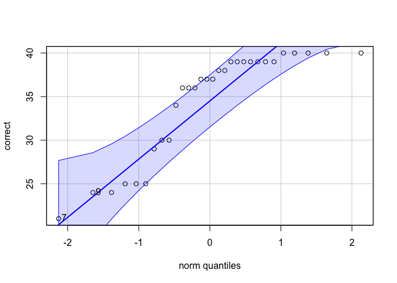<!-- -->

```
## [1] 7 9
```

```r
qqPlot(correct ~ condition, data = Friendly) #creates 1 plot with three parts
```

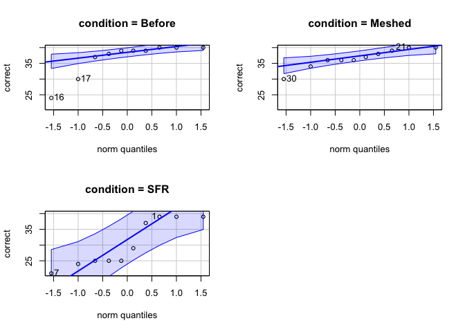<!-- -->

```r
par(mfrow = c(1,3))
qqPlot(~correct, 
       data = Friendly, 
       subset = condition == "SFR", #use subset to plot just one part of the data
       main = "SFR") 
```

```
## [1] 7 1
```

```r
qqPlot(~correct, data = Friendly,
       subset = condition == "Before", 
       id = FALSE, # use id = FALSE to avoid including outlier identification
       main = "Before")  
qqPlot(~correct, data = Friendly, 
       subset = condition == "Meshed", 
       id = F, 
       main = "Meshed")
```

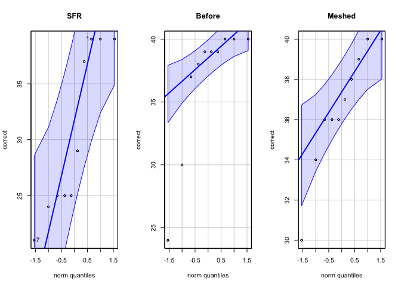<!-- -->

## Base R Plotting

### Legends

#### Basic plot

Let us imagine a fake data set frank, which we create thusly:


```r
frank <- cbind(bob = c(A =10,B = 20,C=35,D=22),
               bonnie = c(60,33,20,15),
               todd = c(34,26,28,81))
```

If I wanted to plot this, I could do so with a barplot, like this:


```r
barplot(frank, beside = TRUE)
```

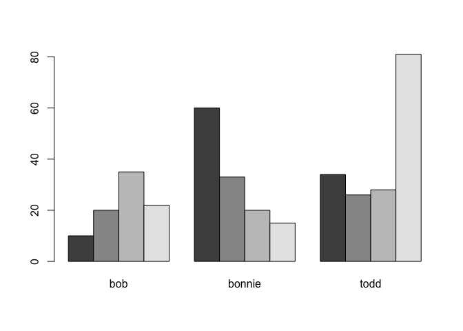<!-- -->

#### Adding the Legend

Adding a legend and some color would be the next logical step:


```r
#sets color of bars according to topo color pallette
barplot(frank, beside = T, col = topo.colors(4)) 
#creates legend with proper colors and names
legend("topright",legend = c("A","B","C","D"), fill=topo.colors(4))
```

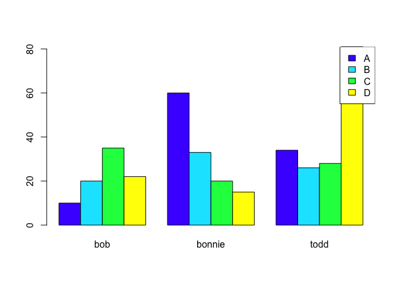<!-- -->

But this results in a problem; our legend is covering the last bar! We could place our legend on the left side instead, but what if we also had tall bars on that side? Instead, let's look at ways to modify legend placement in excruciatingly perfect, granular detail.

#### Moving the Legend

There are two big ways to do this, specifying the x/y of the plot and using inset(). We will start with inset and then use the exact x/y placement method.

##### Inset

Inset is a useful addition to the legend function because it can inset positive and negative values. Positive inset looks like this:


```r
par(mfrow = c(1,2)) # put both plots next to each other
barplot(frank, beside = T, col = hcl.colors(4), main = "No Inset") 
#this legend is placed in the top right without inset
legend("topright", legend = c("A","B","C","D"), fill=hcl.colors(4))

barplot(frank, beside = T, col = hcl.colors(4), main = "Positive Inset") 
#this legend is placed in the top right with a 1.2 x-axis inset and a .1 y axis inset
legend("topright", inset = c(.2,.1), legend = c("A","B","C","D"), fill=hcl.colors(4))
```

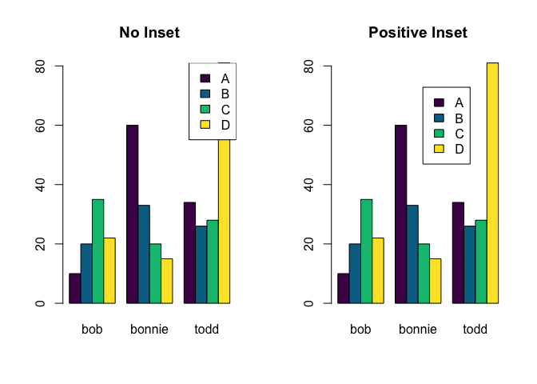<!-- -->

But sometimes you don't want the legend somewhere in the middle of your plot! If we want to place it off to one side, we can use the same inset argument but change the values to be negative:


```r
par(mfrow = c(1,2)) # put both plots next to each other
barplot(frank, beside = T, col = heat.colors(4), main = "No Inset") 
#this legend is placed in the top right without inset
legend("topright", legend = c("A","B","C","D"), fill=heat.colors(4))

barplot(frank, beside = T, col = heat.colors(4), main = "Negative Inset") 
#this legend is placed in the top right with a negative .3 x-axis inset and no y axis inset
legend("topright", inset = c(-.3,0), legend = c("A","B","C","D"), fill=heat.colors(4))
```

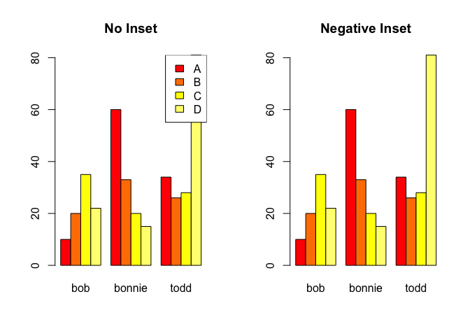<!-- -->

*Where did it go!?* To make a long story short, Base R assigns the margins of a plot before it creates all the elements of that plot. Those margins are, by default, based around the x and y limits of the plot. When we ask our legend function to place a box outside those margins, it does so...but we can't see it. To fix this, all we need to do is adjust our margins before the plot! Our par() arguments are:

* mar = margins around the plot
* xpd = Determines whether to cut off the margins according to the plot or allow items outside the plot area (LIKE WE WANT!!!)
* mfrow = resets our plotting grid to show only one plot per row

All together now, we see this resulting plot:


```r
par(mar = c(4,4,4, 8), xpd = T, mfrow = c(1,1)) 
barplot(frank, beside = T, col = terrain.colors(4), 
        main = "Negative Inset, margins adjusted")
legend("topright", inset = c(-.3,0), legend = c("A","B","C","D"), fill=terrain.colors(4))
```

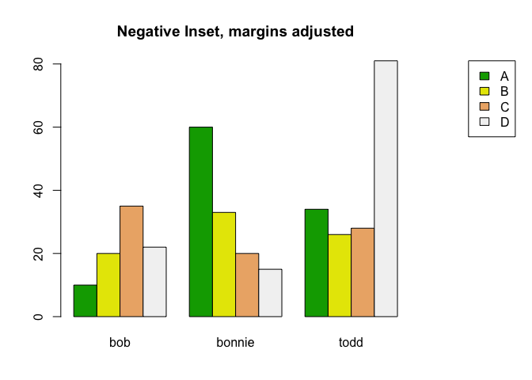<!-- -->


##### specific X/Y placements

If you want to place your plot exactly, without any keywords or tricky fractional inset arguments, you can also give the legend() function the exact x and y coordinates of your legend. If you specify two for each, these values become the bounds for the box around your legend.


```r
par(mar = c(4,4,4,5.5), xpd = T, mfrow = c(1,2), las = 2) 
barplot(frank, beside = T, col = cm.colors(4), main = "X/Y coordinates")
legend(x = 16, y = 70,legend = c("A","B","C","D"), fill=cm.colors(4))

barplot(frank, beside = T, col = cm.colors(4), main = "X/Y boundaries")
legend(x = c(16,25), y = c(60,90), #specify x/y boundaries
       legend = c("A","B","C","D"), #give the elements for the legend
       fill=cm.colors(4), # define the color scheme for the legend items
       title = "Group") #Give your legends titles!
```

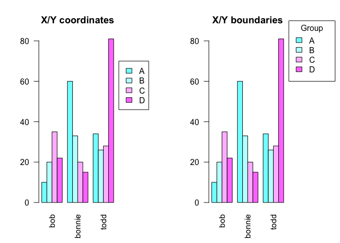<!-- -->

## Some GGPlot stuff

### Scales and Transformations

It is very helpful to modify the scaling with a "trans =" when outliers may obscure the true shape of the data. There are many potential transformations to perform, pseudo-log is used here because the data includes negative numbers (hence a simple log won't work). See also the modified legend alpha, the low alpha to prevent overplotting fatigue results in an unreadable legend without some modification:


```r
trangle <- flights |> dplyr::filter(!(is.na(arr_delay)), carrier == "DL") |> mutate(origin_num = case_when(origin == "LGA" ~ 3, origin == "EWR" ~ 1, origin == "JFK" ~ 2))

ggplot(trangle, aes(y = arr_delay, x = origin_num, color = origin)) + 
  geom_jitter(alpha = .05) +
  labs(title = "Late Arrivals with Delta",
       y = "Arrival Delay (Minutes)",
       x = "",
       color = "Originating Airport") +
  stat_summary(size = 4, color = "gray13", 
               fun = mean, geom = "point") +
  scale_y_continuous(trans = "pseudo_log") + # This line here
    scale_color_stata() +
  theme_clean() +
  guides(colour = guide_legend(override.aes = list(alpha = 1)))
```

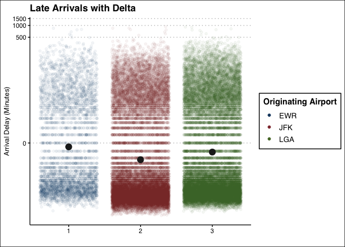<!-- -->


### Facetting and Grid plots

Taking three plots (p, g, and t as follow), this section discusses facetting ggplots and three ways to show different data in multiple or composite plots.

```r
p <-ggplot(plane, aes(aloft, fill = model)) + geom_boxplot() + 
  scale_fill_viridis(discrete = TRUE) + 
  labs(title = "except Buzz", 
       x = "Time aloft (in seconds)", 
       y = "") +
  theme(legend.position = c(.97,.97),
        legend.justification = c("right","top"), 
        axis.text.y = element_blank(), 
        axis.ticks.y = element_blank(), 
        axis.title.y = element_blank())

g <- ggplot(plane, aes(aloft, model, color = model)) +
  geom_beeswarm(groupOnX= FALSE) + 
  scale_color_viridis(discrete = TRUE) + 
  labs(title = "Little difference between models...", 
       x = "Time aloft (in seconds)", y = "") + 
  theme(legend.position = "none")

t <- ggplot(plane, aes(aloft, model, color = unit)) + geom_point()
```

#### Facetting


#### GGplotify/GridExtra


#### Cowplot

Cowplot provides means to combine ggplots with some fairly granular options using plot_grid():


```r
plot_grid(g,p, rel_widths = c(1.2,1.2), nrow = 1)
```

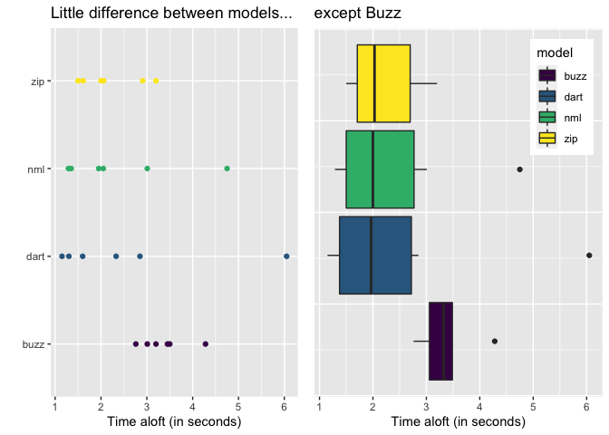<!-- -->


#### Patchwork

Patchwork exists to extend the + grammar of ggplot layers into plot facetting and as such makes it almost stupidly easy to create multiple plots:


```r
g + p # + operator combines two plots
```

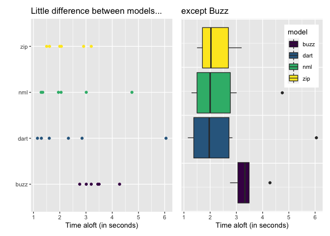<!-- -->

```r
p/t # / operator combines two plots vertically
```

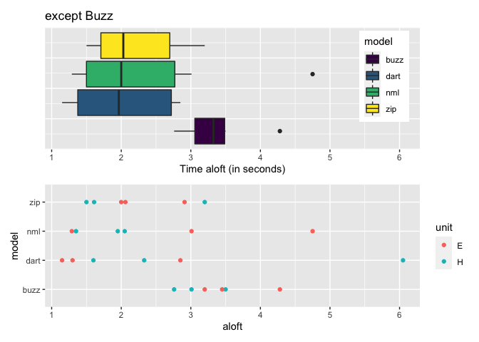<!-- -->

```r
g + p/t # each operator can be combined to breate complex composites
```

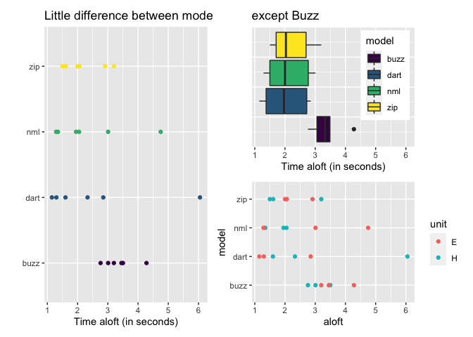<!-- -->
  
vignette("patchwork")  for more information

### Reordering

use reorder() inside aes() to rearrange columns, syntax is reorder(variable to list, argument)
OR, use fct_relevel() from the forcats library (inside tidyverse) to do so 

#### Reorder of Stephanie Rent Barplot

```r
p1 <- ggplot(steph_rent) + 
  #create column chart and reorder y axis by price
   geom_col(aes(y = reorder(Apartment, -Price), x = Price), 
            #change graph color
            color = "chartreuse1", 
             #selections_color is a vector c("chartreuse1", "red", "chart...)
            fill = selections_color) +
   # create vertical line to signify price-range cutoff
   geom_vline(xintercept = 1050, color = "darkred", size = 2)
 #this is how ggplot wiki displays plots, I usually don't assign them as objects.
p1 + guides(fill =
               guide_legend(
                 title.theme = element_text(
                   size = 15,
                   face = "italic",
                   colour = "red",
                   angle = 0
                 )
               )
            )
```

### Things to Group By

One of ggplot's greatest features is the capacity to easily group data according to variables. This is most commonly used to assign different colors:

#### Color and Fill

In a GGPlot object, the plot type determines which variables apply to each plot. Perhaps the most critical are color and fill. Depending on the plot, some have color, some have fill, and some have both...but one of them is the color for the edge of the shapes. Look at the GGPlot Cheat Sheet(s) for help on which is which. Also note that if you want to manually *set* a specific color, you must specify the argument in the ggplot object or layer call but NOT inside the aes(), as this will attempt to use the color name given as a data frame variable to sort the data by. *The same is true for all aesthetics you wish to set manually.*


```r
Pottery_c <- Pottery %>% dplyr::filter(Site != "Caldicot") #removing Caldicot due to small N
p <- ggplot(Pottery_c) + labs(title = "Chemical Composition of Ancient UK Pottery")
#
#geom_boxplot uses FILL
p + geom_boxplot(aes(Al, fill = Site), outlier.shape = NA)
```

<!-- -->

```r
#But geom_point (scatterplots) uses COLOR
p+ geom_point(aes(Al,Fe, color = Site))
```

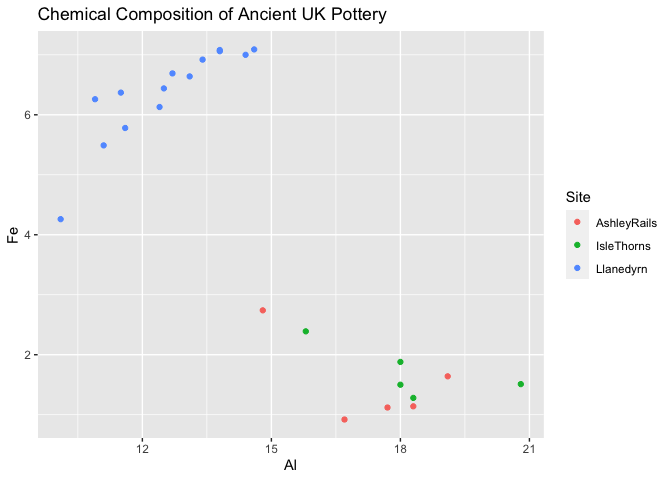<!-- -->


```r
ggplot(GSS_clean, aes(spanks, fill = has_rel)) + #Create plot object
  geom_bar(position = "dodge") + #Add a Bar Plot to the object to visualize
  theme_solarized() + #Theme for quick change of overall aesthetic
  scale_fill_solarized() + #Colorize plot to match theme
  scale_x_discrete(labels = c("Strongly Oppose", "Oppose", #Change the item labels on the x axis
                              "Approve", "Strongly Approve")) + 
  labs(title = "Are Christians more likely to spank their children?",  #change title
       x = "Spanking Preference",  #change x axis title
       y ="Count") + #change y axis title
  guides(fill = guide_legend(title = "Religious Preference")) #change Legend Title
```

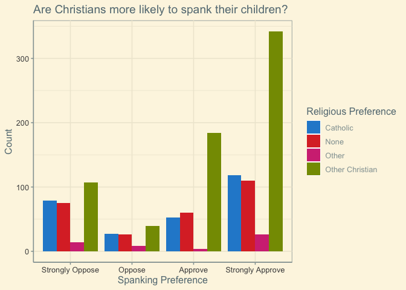<!-- -->

#### Other aesthetics to group by

Color/fill are fine, but also consider alpha, size, and shape, all spelled that way. If using geom_smooth, try linetype. Or, set a boolean with a true false statement in the aesthetic mapping. Lastly, if for insane reason you want to group variables but not change their aesthetics in any way (possibly useful maybe in geom_smooth()), use group = as the aesthetic argument.

See R For Data Science, Chapter 3 for more.

### Matrices

Plotting with Matrices is exciting and fun!

```r
#original matrix, remember that the headers only have to be 
#included in the first instance:
education <- cbind("United States" = c("Engineering" = 61941, 
                                       "Natural Science" = 111158, 
                                       "Social Science" = 182166), 
                   #No headers here\/
                   "Europe" = c(158931, 140126, 116353), 
                   "Asia" = c(280772, 242879, 236018))

#plotting with a matrix in base r is easy:
barplot(education, beside = TRUE, legend.text = TRUE, 
        args.legend = list(x = "topleft", bty = "n"))
```

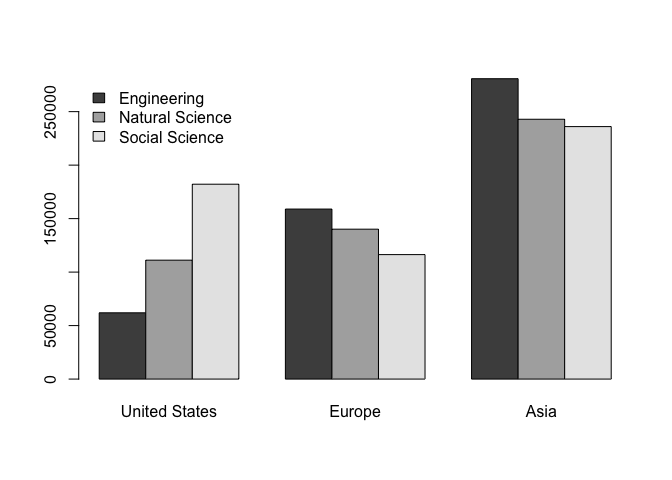<!-- -->

```r
#but that's because base R will accept a matrix and graph it...

#...Unlike GGPlot.
#Because GGPlot only accepts data frames, we have to convert 
#that matrix into one using reshape::melt()

# MAKE SURE library(reshape) IS LOADED!!!
education.df <- melt(education, varnames = c("Type", "Region"))

#Now we can plot this data frame using the "value" variable 
#automatically created by melt():
ggplot(education.df, aes(x = Region, y = value, fill = Type)) + 
  geom_col(position = "dodge") +
  theme_stata() +
  #note that bar plots use FILL, not COLOR aes
  scale_fill_stata()+
  labs(title = "College Degrees awarded by World Region",
       x = "Region",
       y = "Number of Degrees")
```

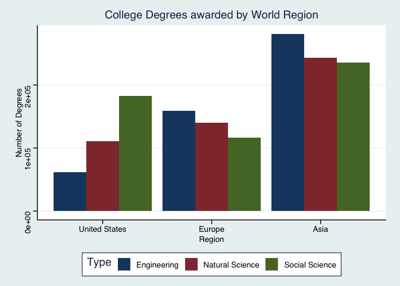<!-- -->


## Common Tests 

### t Test:
Mean score in mem. test for multilingual students > mean score in mem. test for unilingual students

```r
t.test(x = multys$Score_in_memory_game, y = unilings$Score_in_memory_game, alternative = "less")
```

### Wilcox Test
Median length of foot for boys is = median length of foot for girls

```r
wilcox.test(length ~ sex, data = KidsFeet)
```

```
## 
## 	Wilcoxon rank sum test with continuity correction
## 
## data:  length by sex
## W = 252, p-value = 0.0836
## alternative hypothesis: true location shift is not equal to 0
```

### ANOVA

Under the surface, ANOVA and Linear Regression are almost exactly the same function... 

When performing contrasts, ESPECIALLY WITH UNBALANCED DATA, you must alter the model settings for the contrasts. Default settings are altered with:

```r
options(contrasts = c("contr.sum", "contr.poly"))

#or, in the aov() specify the contrasts:
my_model <- aov(exercise ~ageGroup*group, data = Blackmore, contrasts = list(group = contr.sum, ageGroup = contr.sum))
#This adjusts the contrasts for a Type III Sum of Squares, no effect on balanced data.
```

How to write an ANOVA model (balanced) in R:

```r
my_model <- aov(exercise ~ ageGroup + group + ageGroup:group, data = Blackmore)
short_model <- aov(exercise ~ ageGroup*group, data=Blackmore) #shortcut to include both mainset factor and its interaction with one character
```

When viewing the ANOVA table, summary() and anova() are almost the same...EXCEPT that anova() can be referenced with INDEX NOTATION!

```r
summary(planova)
```

```
##             Df Sum Sq Mean Sq F value Pr(>F)
## model        3  4.657  1.5522   1.095  0.380
## unit         1  0.075  0.0748   0.053  0.821
## model:unit   3  6.389  2.1297   1.502  0.252
## Residuals   16 22.686  1.4179
```

```r
anova(planova)
```

```
## Analysis of Variance Table
## 
## Response: aloft
##            Df  Sum Sq Mean Sq F value Pr(>F)
## model       3  4.6567 1.55224  1.0948 0.3799
## unit        1  0.0748 0.07482  0.0528 0.8212
## model:unit  3  6.3891 2.12971  1.5020 0.2521
## Residuals  16 22.6863 1.41789
```
Don't try this with the summary function, it's just not cool enough to keep up with anova():

```r
anova(planova)[1,2] #row 1, column 2
```

```
## [1] 4.656733
```

```r
anova(planova)[2,2] # row 2, column 2
```

```
## [1] 0.07481667
```

```r
anova(planova)[3,1] #row 3, column 1
```

```
## [1] 3
```


### Kruskal-Wallis

Non-Parametric ANOVA, doesn't use a model and hence has no object to summarize. save to an object for future reference or just pander the function call (like a t.test())


```r
#response variable ~ grouping variable, data = dataset
#Same listing of code should work for all base R graphing functions and favstats.
kruskal.test(correct ~ condition, data = Friendly)
```

### Multiple Regression

REMEMBER, INTERACTION VARIABLES ARE ADJUSTMENTS TO THE SLOPE, NOT NEW SLOPES! 

```r
# Qsec is x, mpg is y, transmission is X2
car_gression <- lm(data = mtcars, mpg ~ qsec + am + qsec:am)
summary(car_gression)
# B0 = -9.01 (intercept for automatic cars)
# B1 = 1.4385 (slope for automatic vehicles)
# B2 = -14.5107 (y-int adjust. for manual)
# B3 = 1.3214 (slope adjust. for manual)

# PLOTTING 

#Base R
b <- car_gression$coefficients

plot(mpg ~ qsec, data = mtcars, col = factor(am), pch = 16)
abline(a = b[1], b = b[2]) # baseline (automatic) regression line
abline(a = b[1] + b[3], b = b[2] + b[4], col = "red") # Regression line for manual

# GGPLOT2
ggplot(mtcars, aes(x = mpg, y = qsec, color = factor(am))) + 
  geom_point() +
  geom_smooth(method = lm, span = 5, fullrange = TRUE)


#change plot colors
palette(c("skyblue","firebrick"))
#plot points
plot(mpg ~ qsec, data=mtcars, col=as.factor(am), xlim=c(0,30), ylim=c(-30,40), main="1974 Motor Trend Cars", pch=16)
#create linear model of data (probably should have happened before here)
crunge <- lm(data = mtcars, mpg ~ qsec*am)
#save model coefficients under a new name to make line plotting readable instead of 
#abline(crunge$coefficients[1], crunge$coefficients[2])
b <- crunge$coefficients
#create lines for baseline and adjusted
abline( b[1] , b[2], col=palette()[1])
#note that adjusted line is literally the baseline + the adjusted coefficients
abline( b[1] + b[3], b[2] + b[4], col=palette()[2])
#some pretty words
legend("topleft", legend=c("automatic","manual"), pch=1, col=palette(), title="Transmission (am)", bty="n")
```

### Logistic Regression

Perform logistic regression by assigning them to a model via glm(). glm() is general linear model, response variable is usually $\text{var} > 0$ (here fail >0), which tests logical expression to force a binary response variable. MUST specify family as binomial in glm(). GGPlot doesn't like forced binary variables, requires standalone dummy variables.
REMEMBER, INTERACTION VARIABLES ARE ADJUSTMENTS TO THE SLOPE, NOT NEW SLOPES. B3 = exp(b1+b3)

```r
library (alr4) #get Challenger dataset

#perform Logistic Regression, assign model to LogMod
LogMod <- glm((fail > 0) ~ temp, data = Challeng, family = binomial)

#prepare coefficients for plotting method 2
b <- LogMod$coefficients
#prepare dummy var. for ggplot
Challeng <- Challeng %>% mutate(failed = if_else(fail >0 , 1, 0))

#How to draw the curve in  R, 3 ways

#start with your base plot:
plot(fail > 0 ~ temp, data = Challeng)
#Hardcoded BASE R
curve(exp(15.0429 + -.2322*x) / (1 + exp(15.0429+-.2322*x)), add = TRUE)

#Variablized BASE R
curve(exp(b[1] + b[2]*x) / (1 + exp(b[1] + b[2]*x)), add = TRUE)

#GGPlot
ggplot(Challeng, aes(x = temp, y = failed, col = failed)) + 
  geom_point() +
  #using a geom_smooth in the "glm" method also requires a specifying family = "binomial" method argument.
  geom_smooth(method = "glm", method.args = list(family = "binomial"), se = FALSE) +
  theme_bw()
```

### Chi-Squared Analysis
$$
  H_0: \  \text{Row variable and Column variable are independent} \\
  H_a: \  \text{Row variable and Column variable are associated}
$$

Calculating the $X^2$ (Chi-Squared) Statistic
$$
  X^2 = \sum \frac{(\text{observed count} - \text{expected count})^2}{\text{expected count}}
$$

Calculating a P-Value is very easy, as long as your data is in table format (of counts). But GGPlot (and Donald Trump) wants it to be long form, so you'll need the long form anyways for the plots (Sorry, Obama).
See `Tables` and `Lists` sections of Notes for the data used in this test:

```r
mychi <- chisq.test(mytable) 
mychi %>% pander()
```


-------------------------------
 Test statistic   df   P value 
---------------- ---- ---------
      4.08        4    0.3953  
-------------------------------

Table: Pearson's Chi-squared test: `mytable`

Checking Test Requirements:

* All expected counts >5, OR  
* all expected counts >1 with mean >5  

```r
mychi$expected %>% pander()
```


---------------------------------------------
   &nbsp;      morning   afternoon   evening 
------------- --------- ----------- ---------
 **single**     27.5        25        97.5   

 **dating**     12.83      11.67      45.5   

 **married**    14.67      13.33       52    
---------------------------------------------

When significance is found, it is useful to interpret residuals:

```r
mychi$residuals %>% pander()
```


---------------------------------------------
   &nbsp;      morning   afternoon   evening 
------------- --------- ----------- ---------
 **single**    -0.4767      -1       0.7596  

 **dating**    0.6048     0.9759     -0.8154 

 **married**   0.08704    0.4564     -0.2774 
---------------------------------------------

Larger residuals indicate larger significance and therefore which groups should be focused on.


### Permutation/Randomization Testing

* 1. Calculate original test statistic
* 2. Get a distribution of possible test statistics (assuming original statistic was random chance)
* 3. Calculate p-value


1. Calculate Original Test Statistic

```r
t_test_out <- t.test(length ~ sex, data = KidsFeet)
observed_test_stat <- t_test_out$statistic
observed_test_stat
```

```
##        t 
## 1.917445
```

2. Calculate Distribution

```r
N <- 2000
perm_test_stats <- rep(NA, N)
for (i in 1:N) {
  # you can also mutate a new variable: 
  #KidsFeet_perm_len <- sample(KidsFeet$length)
  #t.test(perm_len ~ sex, data = KidsFeet)
  permuted_test <- t.test(length ~ sample(sex), data = KidsFeet)
  perm_test_stats[i] <- permuted_test$statistic
}
```
2a. (Optional) Visualize distribution

```r
hist(perm_test_stats)
abline(v = observed_test_stat, col = "red", lwd = 3)
```

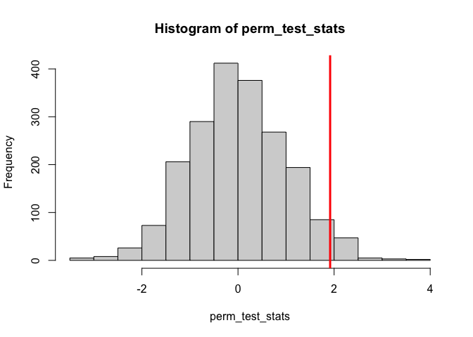<!-- -->

3. Calculate p-value 

```r
# 1 TAIL
sum(perm_test_stats > observed_test_stat) / N #TRUE and FALSE are coerced into binary, trues are added to the total count
```

```
## [1] 0.0325
```

```r
# 2 TAILED
sum(perm_test_stats > observed_test_stat) / N *2 #multiply by two because 2 sides
```

```
## [1] 0.065
```


#### Example 2


```r
# Create the data:
set.seed(1140411)
sample1 <- rnorm(30, 69, 2.5)
sample2 <- rnorm(30, 69, 2.5)
theData <- data.frame(values = c(sample1,sample2), group = rep(c(1,2), each=30))
boxplot(values ~ group, data = theData)
```

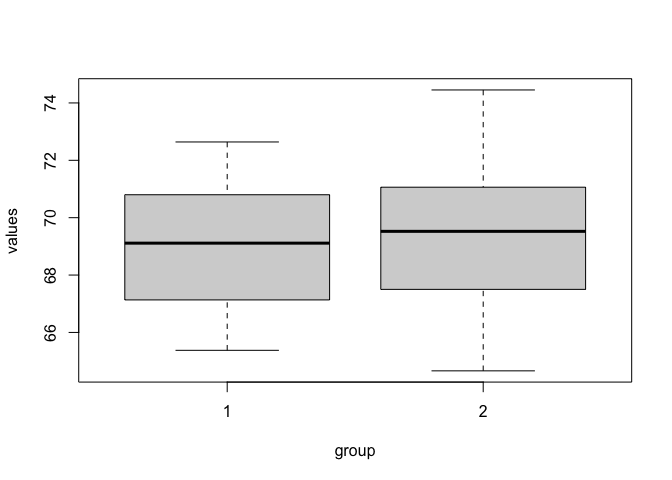<!-- -->

```r
# Run the permutation test:

# original test
myTest <-  t.test(values ~ group, data = theData, mu = 0)
observedTestStat <- myTest$statistic

 
# permute data
# set N
N <- 2000      
# create empty dataframe to put permutations in
permutedTestStats <-  rep(NA, N)
# for loop
for  (i in 1:N ) {
   # create variable for random sample of data
   permutedData <- sample(theData$group)
   # perform t test using random sample of the data
   permutedTest <- t.test(values ~ permutedData, data = theData, mu = 0)
   # assign test statistic to relevant data frame index
   permutedTestStats[i]  <-  permutedTest$statistic
}
# create histogram of calculated test statistics
hist(permutedTestStats)
# add a line to the histogram for the original z-score
abline(v=observedTestStat)
```

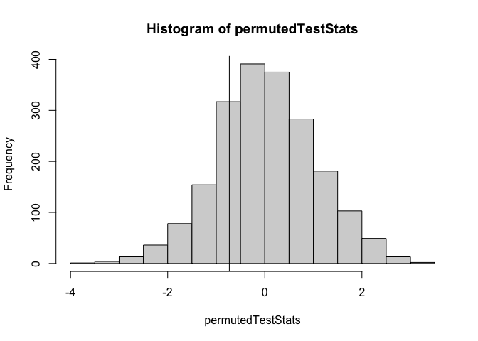<!-- -->

```r
# Calculate a P-value for the permutation test
# calculate number of permuted statistics greater than the original (right-tailed)
sum(permutedTestStats >= observedTestStat)/N
```

```
## [1] 0.7705
```

```r
# calculate number of permuted statistics less than the original (left-tailed)
sum(permutedTestStats <= observedTestStat)/N
```

```
## [1] 0.2295
```

```r
# calculate number of permuted statistics more extreme than the original (two-tailed)
2*(sum(permutedTestStats <= observedTestStat)/N)
```

```
## [1] 0.459
```

## Random generation with R

Base R offers many, many ways to randomly generate numbers. For each standard distribution, there are q,n,and p functions, but the r function is the one that randomly generates numbers according to the distribution. For normal distributions, rnorm(). For generation where each value is equally likely to be chosen, runif(); which does not mean run if but rather *R*andom *UNIF*orm. 


```r
roll <- function(n, sides = 6) {
# generates n random integers between 1 and sides inclusive 
# X in [1,sides]
  if(sides < 1 || sides %% 1 != 0) {
    stop("Cannot roll a die with non-integer or zero sides!")
  }
  trunc(runif(n,1,sides+1),0)
}


g1 <- rnorm(40,69,2.5)
g2 <- rnorm(40,69,2.5)
Dat <- data.frame(values = c(g1,g2), group = rep(c(1,2), each = 40))
sTest <- t.test(values~group, data = Dat)
sTest
```

```
## 
## 	Welch Two Sample t-test
## 
## data:  values by group
## t = -1.4563, df = 77.817, p-value = 0.1493
## alternative hypothesis: true difference in means between group 1 and group 2 is not equal to 0
## 95 percent confidence interval:
##  -1.752975  0.271848
## sample estimates:
## mean in group 1 mean in group 2 
##        68.75925        69.49981
```

